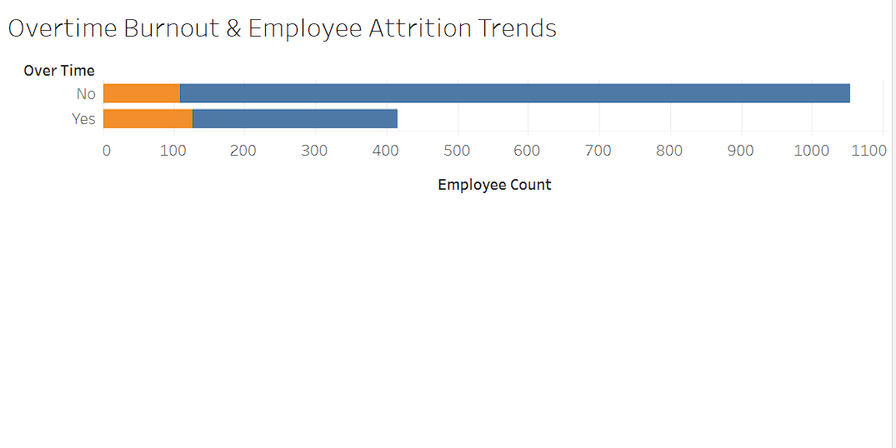

# Human-Centered People Analytics: Workforce Attrition & Retention Modeling

👉 [**Click here to interact with the live Tableau Dashboard**](https://public.tableau.com/app/profile/tiffany.stewart8681/viz/WorkforceAttritionandBurnoutRiskAnalysis/Sheet1)
)

## 📌 Project Perspective & Executive Summary
Data can tell us *what* is happening across an institution, but a human-centered approach is required to understand *why*. This project bridges advanced behavioral insights with technical data analysis, evaluating a multi-variable workforce dataset of 1,470 records to uncover the underlying patterns behind employee turnover. 

Coming from a background in clinical psychology, I view data tracking as a tool to understand human environments and institutional health. I built this interactive dashboard to translate raw personnel files into actionable, systemic strategies—giving leadership the visual tools they need to spot early fatigue trends, address compensation gaps, and build healthier, more sustainable workplace cultures.

## 🛠️ Combined Technical & Behavioral Skillset
* **Behavioral Analytics & Modeling:** Applying systems-thinking to behavioral metrics, translating multi-variable employee logs into team insights.
* **Data Visualization & BI:** Tableau (Calculated Fields, Dynamic Filters, Parameters).
* **Workforce Insights:** Metric tracking for voluntary attrition, compensation equity, and environmental satisfaction.

---

## 📊 Dashboard Visual Preview & Strategic Insights

Below is a visual layout of the completed workforce attrition model. 

### 1. The Burnout Indicator: Overtime vs. Retention
* **The Human Pattern:** Personnel working overtime show a disproportionately high turnover rate compared to standard-hour employees. This highlights operational overload as a clear, predictable leading indicator for voluntary exits.
* **Systemic Solution:** Implement strict departmental thresholds on continuous overtime and establish formal wellness and workload check-ins for high-stress operational teams.

### 2. Economic Triggers: Compensation Distribution
* **The Human Pattern:** Attrition heavily spikes among staff in lower monthly income brackets who also experience stagnant promotion histories. This proves that career growth ceilings and compensation equity are directly tied to keeping mid-career talent.
* **Systemic Solution:** Conduct targeted departmental equity reviews for long-tenured employees to ensure compensation matches their contribution and prevents institutional knowledge drain.

### 3. Cultural Factors: Environment & Connection
* **The Human Pattern:** Low scores in "Relationship with Manager" and "Work Environment Satisfaction" strongly correlate with early-stage voluntary exits, particularly for staff with less than two years of tenure.
* **Systemic Solution:** Enhance early-stage peer mentorship networks and introduce safe, anonymous quarterly pulse check-ins to fix toxic department climates before departures occur.

---

## 📁 Repository Structure
* `/data`: Contains the raw IBM HR Analytics dataset (`WA_Fn-UseC_-HR-Employee-Attrition.csv`).
* `dashboard_preview.png`: Source visualization layout image.
* `README.md`: Project summary, behavioral insights, and systemic framework.

## 🎓 Methodology & Attribution
The foundational dataset utilized for this study originates from the IBM HR Analytics platform via Kaggle. Visual modeling, behavioral analysis, and strategic recommendations were developed independently to demonstrate modern, empathetic people analytics capabilities.
